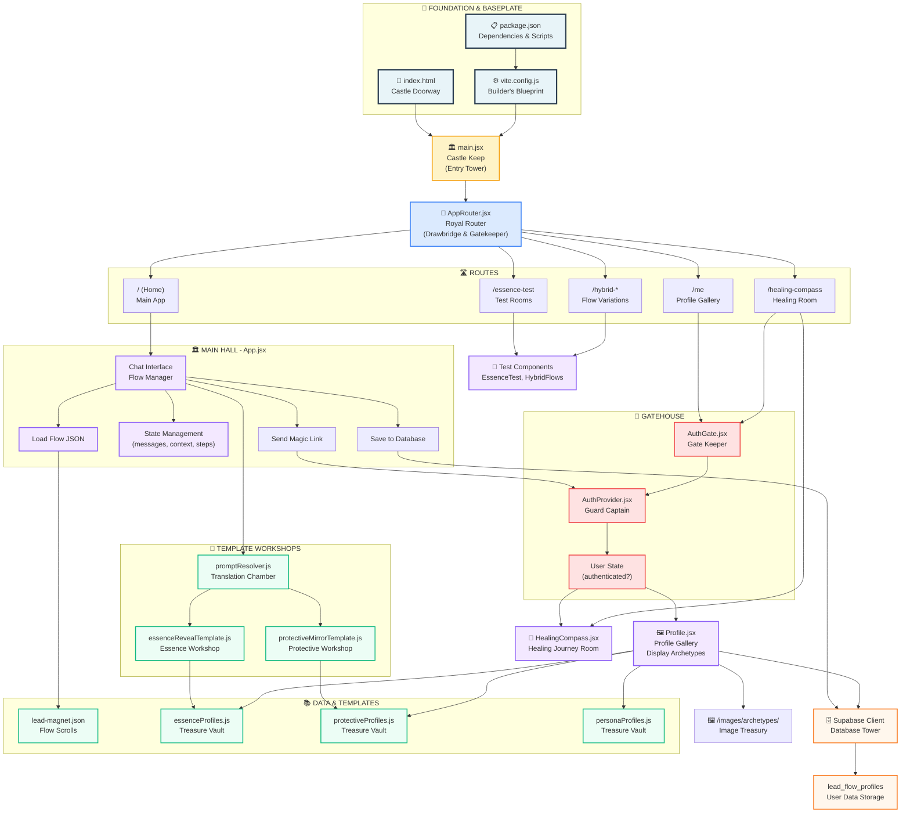
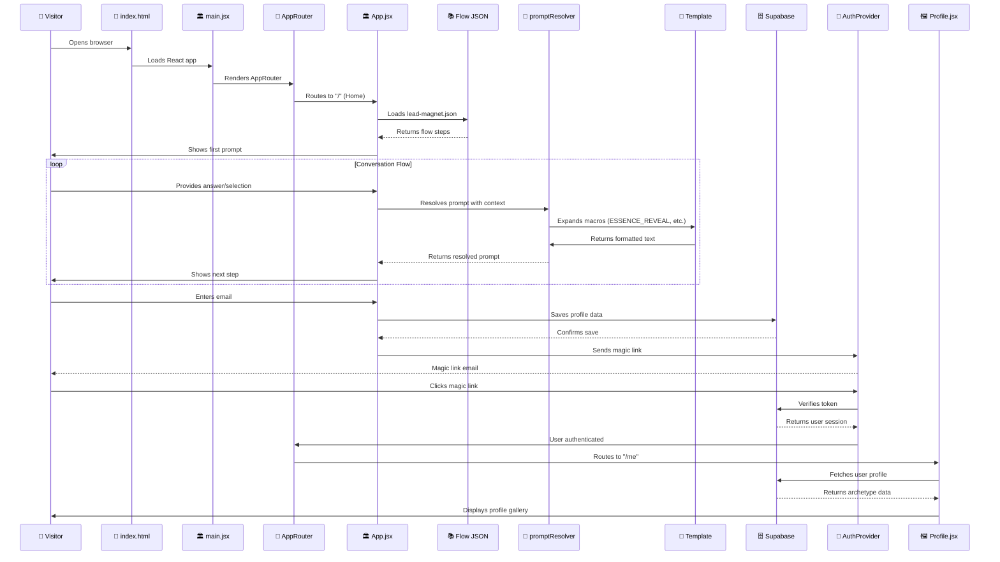
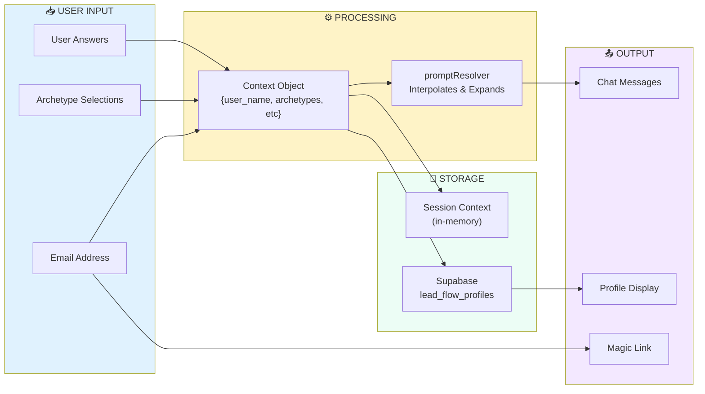

# FindMyFlow Lego Castle Architecture

## Visual Flow Chart

```mermaid
graph TB
    %% Foundation Layer
    subgraph Foundation["🏰 FOUNDATION & BASEPLATE"]
        direction TB
        PKG["📋 package.json<br/>Dependencies & Scripts"]
        HTML["🚪 index.html<br/>Castle Doorway"]
        VITE["⚙️ vite.config.js<br/>Builder's Blueprint"]
    end

    %% Entry Point
    MAIN["🏛️ main.jsx<br/>Castle Keep<br/>(Entry Tower)"]
    
    %% Router Layer
    ROUTER["🌉 AppRouter.jsx<br/>Royal Router<br/>(Drawbridge & Gatekeeper)"]
    
    %% Routes
    subgraph Routes["🛣️ ROUTES"]
        direction LR
        R1["/ (Home)<br/>Main App"]
        R2["/me<br/>Profile Gallery"]
        R3["/healing-compass<br/>Healing Room"]
        R4["/essence-test<br/>Test Rooms"]
        R5["/hybrid-*<br/>Flow Variations"]
    end
    
    %% Main Components
    subgraph MainHall["🏛️ MAIN HALL - App.jsx"]
        direction TB
        APP["Chat Interface<br/>Flow Manager"]
        FLOWLOAD["Load Flow JSON"]
        STATEMGR["State Management<br/>(messages, context, steps)"]
        DBSAVE["Save to Database"]
        MAGIC["Send Magic Link"]
    end
    
    %% Authentication System
    subgraph AuthSystem["🔐 GATEHOUSE"]
        direction TB
        AUTH_PROV["AuthProvider.jsx<br/>Guard Captain"]
        AUTH_GATE["AuthGate.jsx<br/>Gate Keeper"]
        USER_STATE["User State<br/>(authenticated?)"]
    end
    
    %% Data Layer
    subgraph DataLayer["📚 DATA & TEMPLATES"]
        direction TB
        FLOW_JSON["lead-magnet.json<br/>Flow Scrolls"]
        ESSENCE_PROF["essenceProfiles.js<br/>Treasure Vault"]
        PROT_PROF["protectiveProfiles.js<br/>Treasure Vault"]
        PERSONA_PROF["personaProfiles.js<br/>Treasure Vault"]
    end
    
    %% Template System
    subgraph Templates["🎨 TEMPLATE WORKSHOPS"]
        direction TB
        RESOLVER["promptResolver.js<br/>Translation Chamber"]
        ESSENCE_TEMP["essenceRevealTemplate.js<br/>Essence Workshop"]
        PROT_TEMP["protectiveMirrorTemplate.js<br/>Protective Workshop"]
    end
    
    %% Database
    SUPABASE["🗄️ Supabase Client<br/>Database Tower"]
    DB_TABLE["lead_flow_profiles<br/>User Data Storage"]
    
    %% Profile Component
    PROFILE["🖼️ Profile.jsx<br/>Profile Gallery<br/>Display Archetypes"]
    
    %% Other Components
    HEALING["💊 HealingCompass.jsx<br/>Healing Journey Room"]
    TESTS["🧪 Test Components<br/>EssenceTest, HybridFlows"]
    
    %% Image Assets
    IMAGES["🖼️ /images/archetypes/<br/>Image Treasury"]
    
    %% Connections - Foundation
    PKG --> VITE
    HTML --> MAIN
    VITE --> MAIN
    
    %% Entry Flow
    MAIN --> ROUTER
    
    %% Router to Routes
    ROUTER --> R1
    ROUTER --> R2
    ROUTER --> R3
    ROUTER --> R4
    ROUTER --> R5
    
    %% Main App Flow
    R1 --> APP
    APP --> FLOWLOAD
    FLOWLOAD --> FLOW_JSON
    APP --> STATEMGR
    APP --> RESOLVER
    
    %% Template Resolution
    RESOLVER --> ESSENCE_TEMP
    RESOLVER --> PROT_TEMP
    ESSENCE_TEMP --> ESSENCE_PROF
    PROT_TEMP --> PROT_PROF
    
    %% Database Flow
    APP --> DBSAVE
    DBSAVE --> SUPABASE
    SUPABASE --> DB_TABLE
    APP --> MAGIC
    MAGIC --> AUTH_PROV
    
    %% Authentication Flow
    R2 --> AUTH_GATE
    R3 --> AUTH_GATE
    AUTH_GATE --> AUTH_PROV
    AUTH_PROV --> USER_STATE
    USER_STATE --> PROFILE
    USER_STATE --> HEALING
    
    %% Profile Data Flow
    PROFILE --> SUPABASE
    PROFILE --> ESSENCE_PROF
    PROFILE --> PROT_PROF
    PROFILE --> PERSONA_PROF
    PROFILE --> IMAGES
    
    %% Other Routes
    R3 --> HEALING
    R4 --> TESTS
    R5 --> TESTS
    
    %% Styling
    classDef foundation fill:#e8f4f8,stroke:#2c3e50,stroke-width:3px
    classDef entry fill:#fef3c7,stroke:#f59e0b,stroke-width:2px
    classDef router fill:#dbeafe,stroke:#3b82f6,stroke-width:2px
    classDef component fill:#f3e8ff,stroke:#8b5cf6,stroke-width:2px
    classDef data fill:#ecfdf5,stroke:#10b981,stroke-width:2px
    classDef auth fill:#fee2e2,stroke:#ef4444,stroke-width:2px
    classDef database fill:#fff7ed,stroke:#f97316,stroke-width:2px
    
    class PKG,HTML,VITE foundation
    class MAIN entry
    class ROUTER router
    class APP,FLOWLOAD,STATEMGR,PROFILE,HEALING,TESTS component
    class FLOW_JSON,ESSENCE_PROF,PROT_PROF,PERSONA_PROF,RESOLVER,ESSENCE_TEMP,PROT_TEMP data
    class AUTH_PROV,AUTH_GATE,USER_STATE auth
    class SUPABASE,DB_TABLE database
```

## User Journey Flow

```mermaid
sequenceDiagram
    participant User as 👤 Visitor
    participant HTML as 🚪 index.html
    participant Main as 🏛️ main.jsx
    participant Router as 🌉 AppRouter
    participant App as 🏛️ App.jsx
    participant Flow as 📚 Flow JSON
    participant Resolver as 🎨 promptResolver
    participant Template as 🎨 Template
    participant DB as 🗄️ Supabase
    participant Auth as 🔐 AuthProvider
    participant Profile as 🖼️ Profile.jsx
    
    User->>HTML: Opens browser
    HTML->>Main: Loads React app
    Main->>Router: Renders AppRouter
    Router->>App: Routes to "/" (Home)
    App->>Flow: Loads lead-magnet.json
    Flow-->>App: Returns flow steps
    App->>User: Shows first prompt
    
    loop Conversation Flow
        User->>App: Provides answer/selection
        App->>Resolver: Resolves prompt with context
        Resolver->>Template: Expands macros (ESSENCE_REVEAL, etc.)
        Template->>Resolver: Returns formatted text
        Resolver-->>App: Returns resolved prompt
        App->>User: Shows next step
    end
    
    User->>App: Enters email
    App->>DB: Saves profile data
    DB-->>App: Confirms save
    App->>Auth: Sends magic link
    Auth-->>User: Magic link email
    
    User->>Auth: Clicks magic link
    Auth->>DB: Verifies token
    DB-->>Auth: Returns user session
    Auth->>Router: User authenticated
    Router->>Profile: Routes to "/me"
    Profile->>DB: Fetches user profile
    DB-->>Profile: Returns archetype data
    Profile->>User: Displays profile gallery
```

## Data Flow Architecture

```mermaid
graph LR
    subgraph Input["📥 USER INPUT"]
        ANSWERS["User Answers"]
        SELECTIONS["Archetype Selections"]
        EMAIL["Email Address"]
    end
    
    subgraph Processing["⚙️ PROCESSING"]
        CONTEXT["Context Object<br/>{user_name, archetypes, etc}"]
        RESOLVER2["promptResolver<br/>Interpolates & Expands"]
    end
    
    subgraph Storage["💾 STORAGE"]
        SESSION["Session Context<br/>(in-memory)"]
        DB2["Supabase<br/>lead_flow_profiles"]
    end
    
    subgraph Output["📤 OUTPUT"]
        MESSAGES["Chat Messages"]
        PROFILE2["Profile Display"]
        MAGIC2["Magic Link"]
    end
    
    ANSWERS --> CONTEXT
    SELECTIONS --> CONTEXT
    EMAIL --> CONTEXT
    
    CONTEXT --> SESSION
    CONTEXT --> RESOLVER2
    RESOLVER2 --> MESSAGES
    
    CONTEXT --> DB2
    DB2 --> PROFILE2
    
    EMAIL --> MAGIC2
    
    style Input fill:#e0f2fe
    style Processing fill:#fef3c7
    style Storage fill:#ecfdf5
    style Output fill:#f3e8ff
```

